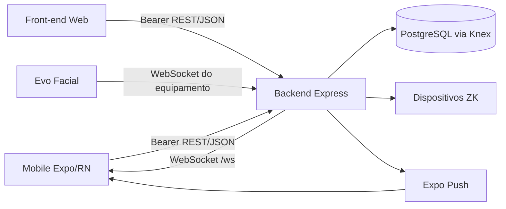

# Análise do Segundo Cérebro: [[Ponto SaaS]]

## Escopo e evidências

- Vault analisado: `ponte escolar`.
- Notas encontradas antes desta análise:
  - [[Bem-vindo]]
  - [[crie um link]]
  - [[RELATORIO_TECNICO_ARQUITETURA_PONTO_SAAS]]
- Configuração existente:
  - [[.github/copilot-instructions.md]]
  - [[.github/skills/obsidian-second-brain/SKILL.md]]
- A referência técnica anexada descreve o estado do mobile no commit `09e8ddb`, em 12/09/2026.
- Não foram criadas conclusões sobre arquivos que não aparecem nas evidências disponíveis.

## Estado do segundo cérebro

### Diagnóstico

- **Estado:** inicial e pouco conectado.
- **Concentração de conhecimento:** alta; quase todo o contexto está em [[RELATORIO_TECNICO_ARQUITETURA_PONTO_SAAS]].
- **Mapas de navegação:** não existe um MOC/índice do projeto.
- **Taxonomia:** não existem as pastas `00_Inbox`, `10_Projetos`, `20_Areas`, `30_Recursos` ou `40_Arquivo`.
- **Registro de decisões:** não há nota dedicada a decisões arquiteturais ou ADRs.
- **Registro de tarefas:** não havia backlog estruturado para o mobile.
- **Links internos:** o relatório técnico possui links planejados para notas que ainda não existem, como [[Regras de Negócio]], [[Arquitetura de Banco de Dados]] e [[Offline First Mobile]].
- **Automação Copilot:** a skill [[.github/skills/obsidian-second-brain/SKILL.md]] e as instruções globais já orientam leitura sob demanda e economia de tokens.

### Risco de conhecimento

- Uma nota única e longa aumenta o custo de contexto quando apenas uma parte do projeto é necessária.
- Notas referenciadas mas inexistentes reduzem a navegabilidade do grafo.
- O vault mistura relatório técnico, contexto histórico e backlog implícito, dificultando rastrear o que é estado atual, decisão ou tarefa.
- A nota técnica registra corretamente várias incertezas, mas não possui status de atualização por seção.
- O vault não registra ainda a relação entre requisito, task, implementação e validação.

## Mapa atual do projeto

- [[Ponto SaaS]] é um sistema multiempresa de controle de ponto com dois domínios:
  - controle de funcionários/REP-P;
  - operação escolar com turmas, alunos, responsáveis, presença em sala e avisos.
- [[Backend Ponto SaaS]]:
  - Node.js, Express, Knex e PostgreSQL;
  - API REST modular;
  - JWT Bearer com separação `staff`/`responsavel`;
  - integrações ZK e Evo Facial;
  - WebSocket para realtime e workers para coleta/agendamento.
- [[Mobile Ponto SaaS]]:
  - Expo SDK 54, React Native, React Navigation;
  - perfis responsável e professor;
  - cache GET, fila offline, push e realtime;
  - principal risco atual: dados, identidade e operações offline ainda não estão completamente isolados.
- [[Front-end Web Ponto SaaS]]:
  - documentado no README como React/Vite para painel staff;
  - código não estava disponível no filesystem analisado; status deve ser confirmado antes de documentar implementação.
- [[Banco de Dados Ponto SaaS]]:
  - migrations Knex cobrem domínios trabalhista e escolar;
  - Prisma não possui modelos de domínio ativos.

## Relações arquiteturais

## Conhecimento confirmado

- O mobile diferencia presença facial de presença em sala.
- `atribuicao_id` é necessário para registrar chamada, nota e observação do professor.
- A fila offline pode reenviar escritas quando a conectividade volta.
- O backend valida tipo de token e, para staff, papel/permissão e tenant.
- O WebSocket mobile atual usa `/ws?token=...`, enquanto o histórico técnico diferencia esse fluxo do protocolo Evo Facial.
- A janela oficial de horário da turma é diferente da classificação visual de batidas “Chegada/Saída”.

## Lacunas prioritárias do conhecimento

- Contrato completo do payload de `horarios_turma` e regra de exibição da janela da turma.
- Endpoints autorizados para ficha do aluno quando o usuário é professor.
- Política oficial de cache, retenção e expiração para dados de menores.
- Estratégia de idempotência da fila offline no backend.
- Contrato de eventos realtime e política para eventos perdidos/duplicados.
- Estado real do front-end web e seu processo de build/deploy.
- Critérios de aceite e ambientes de teste para mobile, backend e dispositivo físico.

## Estrutura recomendada para evolução do vault

Criar gradualmente, apenas quando houver conteúdo real:

- `10_Projetos/Ponto SaaS/` para notas do produto.
- `10_Projetos/Ponto SaaS/Mobile/` para arquitetura e tasks mobile.
- `10_Projetos/Ponto SaaS/Backend/` para API, banco e dispositivos.
- `20_Areas/Engenharia/` para padrões reutilizáveis.
- `30_Recursos/` para LGPD, Portaria 671 e documentação de fornecedores.
- `40_Arquivo/` para relatórios substituídos.

Não mover as notas existentes automaticamente. Primeiro criar um MOC e validar a taxonomia.

## Próximas notas recomendadas

1. [[MOC Ponto SaaS]] — índice curto com links por domínio.
2. [[Tasks Mobile Ponto SaaS]] — backlog priorizado criado nesta análise.
3. [[Decisões Arquiteturais Ponto SaaS]] — ADRs e decisões reversíveis/irreversíveis.
4. [[Contratos API Mobile Ponto SaaS]] — endpoints, payloads, erros e permissões.
5. [[Modelo de Dados Escolar]] — entidades, vínculos, escopos e regras.
6. [[Operação Offline Mobile]] — cache, fila, idempotência e troca de conta.

## Conclusão operacional

O segundo cérebro já tem uma base técnica útil, mas ainda funciona como arquivo de relatório, não como sistema de conhecimento conectado. A primeira melhoria é separar contexto estável, decisões, contratos e tasks. O backlog em [[Tasks Mobile Ponto SaaS]] transforma os problemas já confirmados em trabalho executável sem duplicar o relatório técnico.
